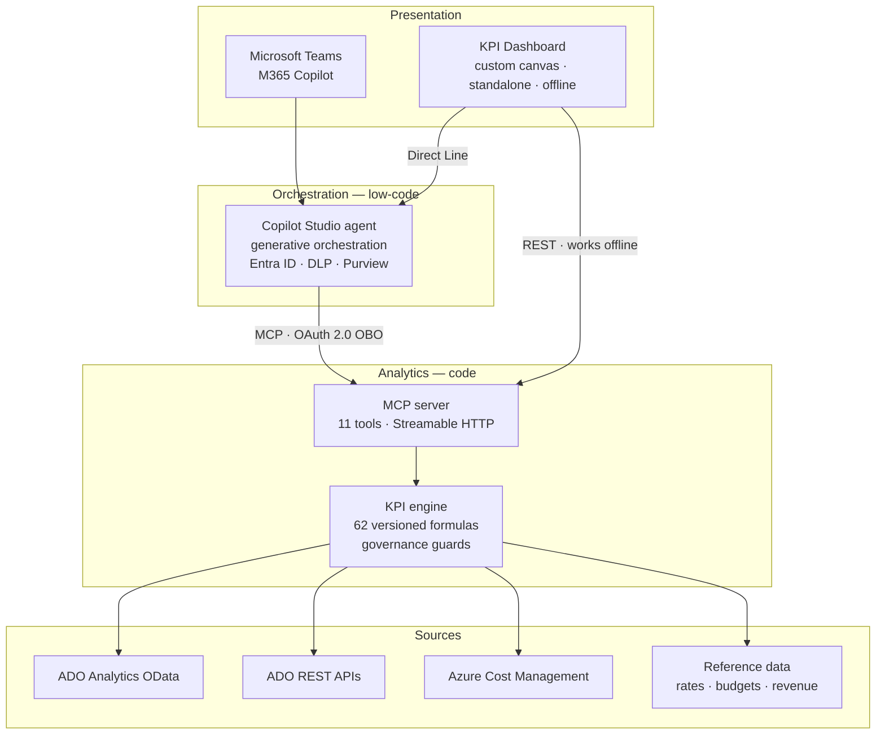

# Azure DevOps FinOps & Delivery Intelligence Agent

An AI agent that answers the three questions engineering leadership actually gets asked:

> **Are we delivering?** · **What is it costing us?** · **Are we making money on it?**

It computes **62 versioned KPIs** across delivery performance, flow, agile execution, code
health, pipeline FinOps, team capacity, project profitability and cloud cost allocation —
from Azure DevOps Analytics, Azure DevOps REST and Azure Cost Management.

Built on **Microsoft Copilot Studio** for the conversation, a **Model Context Protocol
server** for the analytics, and a purpose-built **KPI dashboard** for the visuals.

---

## The architecture question, answered honestly

This agent was originally proposed as a pure Copilot Studio build, on the assumption that it
would be simpler than the custom Azure + GitHub architecture used for its sibling, the Azure
FinOps Agent.

**That assumption is half right, and the half that is wrong matters.**

| Claim | Verdict |
| --- | --- |
| Faster to build | ✅ True — days, not weeks |
| Less infrastructure to own | ✅ True |
| Governance built in (DLP, Purview, Agent 365, CMK, VNet) | ✅ True |
| Enterprise identity is easier | ✅ True — `User.AccessToken` gives real on-behalf-of access |
| Reuses an existing MCP investment | ✅ True — MCP is GA over Streamable HTTP |
| Can be the KPI dashboard | ❌ **False** — no native chart rendering, Adaptive Cards only |
| Can aggregate the data | ❌ **False** — 5 MB payload ceiling, ~2 min action timeout |
| Can be demonstrated offline | ❌ **False** — pure SaaS, no emulator, no container |
| Full CI/CD parity | ⚠️ **Partial** — auth, channels and App Insights are not solution-aware |

So this is a **hybrid**, and each layer sits where it is genuinely strongest:



Full reasoning, evidence and the conditions that would reverse this decision:
**[ADR-0001](docs/adr/ADR-0001-agent-platform.md)**.

---

## What makes this different from a Power BI report

**1. It refuses to guess.** Azure DevOps holds no budgets, labour rates or contract revenue.
When those are missing, the agent names the exact missing input rather than rendering a zero
or an estimate. A fabricated blended rate produces a board-ready number that is wrong.

**2. It refuses to rank people.** Every KPI declares a minimum aggregation level, enforced in
code by [`guards.ts`](mcp-server/src/kpi/guards.ts) — not in a prompt. Neither the agent, the
dashboard, nor a direct API call can produce individual performance metrics. A second,
independent control exists as a Copilot Studio topic, because instructions erode under a
persistent user.

**3. It pairs metrics with their counterweights.** Deployment frequency without change failure
rate, or utilisation without lead time, produces confidently bad decisions. The catalog
encodes these pairings and the agent is instructed to surface them.

**4. Formulas are code under review.** 62 KPIs, each versioned. Changing a formula requires
bumping its revision, because trend data is only comparable within a revision. 33 tests
enforce that the catalog and the calculators cannot drift apart.

**5. It reports its own data quality.** Every scorecard carries a completeness percentage, tag
coverage, missing reference data and low-confidence warnings. Allocated cloud cost is always
qualified with tag coverage — below 95%, it is showback and a lower bound, never chargeback.

---

## Try it in two minutes

No Azure subscription, no Azure DevOps organisation, no tenant.

```powershell
git clone https://github.com/tinocodemos/azure-devops-finops-agent
cd azure-devops-finops-agent

# 1. KPI server, seeded with deterministic demo data
cd mcp-server; npm install; npm run build
$env:DATA_MODE='demo'
$env:REFERENCE_DATA_DIR='../reference-data'
$env:DASHBOARD_DIR='../dashboard/dist'
node dist/index.js

# 2. dashboard (in a second terminal)
cd dashboard; npm install; npm run build
```

Then open **http://127.0.0.1:8787**.

The demo generates four Contoso projects with deliberately different engineering health
profiles — one healthy, one under cost pressure, one with a pipeline waste problem, one at
delivery risk — so there is something worth reasoning about rather than uniform noise. Same
seed, same organisation, every time.

> Looking for the one-click `.exe` launcher? That lives in the
> [demo repository](https://github.com/tinocodemos/azure-devops-finops-agent-demo), which is
> this repository plus a self-contained Windows executable.

---

## The KPI catalog

| Domain | KPIs | Examples |
| --- | --- | --- |
| **Delivery Performance** | 5 | Deployment frequency, change lead time, change failure rate, MTTR, deployment rework rate |
| **Flow Metrics** | 6 | Flow time, cycle time, flow efficiency, WIP, flow distribution |
| **Agile Execution** | 8 | Velocity, say-do ratio, escaped defects, rework rate, backlog aging, estimation accuracy |
| **Code & Review Health** | 9 | PR cycle time, review latency, PR size, build success, flaky tests, coverage |
| **Pipeline FinOps** | 7 | Minutes consumed, queue wait, failed-run waste, pool utilisation, cost per successful build |
| **Team Performance** | 7 | Capacity vs actual, utilisation, focus factor, unplanned work, knowledge concentration |
| **Project Profitability** | 14 | EV, AC, PV, CPI, SPI, EAC, ETC, burn rate, gross margin, cost per story point |
| **Cloud FinOps Linkage** | 6 | Tag coverage, cost per project, non-prod off-hours waste, cost per deployment |

Each KPI carries its formula, unit, direction, thresholds, industry benchmark, interpretation,
caveats, paired metrics and data feasibility. Full catalog: **[docs/KPI-CATALOG.md](docs/KPI-CATALOG.md)**.
Source of truth: [`kpi-engine/catalog/*.yaml`](kpi-engine/catalog/) — deliberately YAML, so a
finance partner can audit a formula in a pull request without reading TypeScript.

**Feasibility is stated honestly.** `native` comes straight from Azure DevOps. `derived` needs
a naming or tagging convention you configure. `external` needs finance or Azure cost data that
Azure DevOps simply does not hold.

---

## Repository layout

| Path | What it is |
| --- | --- |
| [`kpi-engine/catalog/`](kpi-engine/catalog/) | The 62 KPI definitions. The product's core intellectual asset. |
| [`mcp-server/`](mcp-server/) | TypeScript MCP server: 11 tools, the KPI engine, governance guards, live and demo providers. |
| [`dashboard/`](dashboard/) | Vue 3 + ECharts KPI dashboard. Custom canvas, standalone and offline. |
| [`copilot-studio/`](copilot-studio/) | Agent definition, instructions, topics, adaptive cards, ALM scripts. |
| [`infra/`](infra/) | Bicep: Container Apps, Key Vault, App Insights, managed identity, private endpoints, budget alert. |
| [`reference-data/`](reference-data/) | Rate card, project budgets and conventions. The inputs Azure DevOps cannot supply. |
| [`docs/`](docs/) | Architecture decisions, security, threat model, ALM, cost model, responsible metrics. |

---

## Documentation

| Document | Read it when |
| --- | --- |
| [ADR-0001 — Agent platform](docs/adr/ADR-0001-agent-platform.md) | You want the Copilot Studio vs custom vs hybrid reasoning |
| [Platform evaluation](docs/PLATFORM-EVALUATION.md) | You want the underlying evidence and limits |
| [Architecture](docs/ARCHITECTURE.md) | You are integrating or extending it |
| [KPI catalog](docs/KPI-CATALOG.md) | You want every formula, benchmark and caveat |
| [Security](docs/SECURITY.md) | You are doing a security review |
| [Threat model](docs/THREAT-MODEL.md) | You are doing a threat review |
| [Responsible metrics](docs/RESPONSIBLE-METRICS.md) | You are worried about how these numbers will be used — you should be |
| [ALM](docs/ALM.md) | You are deploying across environments |
| [Cost model](docs/COST-MODEL.md) | You need to budget it |
| [Runbook](docs/RUNBOOK.md) | Something is wrong in production |

---

## Requirements

**To run the demo:** Node.js 20+. Nothing else.

**To run it for real:**

- Azure DevOps organisation with the Analytics service enabled
- Azure subscription (Container Apps, Key Vault, Log Analytics, Application Insights)
- Microsoft Copilot Studio licence, or Copilot Credits on pay-as-you-go
- Power Platform environment with Dataverse
- Microsoft Entra ID application registration with federated credentials

---

## Security posture

- **No secrets anywhere.** Workload identity federation and managed identity throughout.
  There is no client secret in this repository, in any settings file, or in Key Vault.
- **User-delegated access.** Interactive queries run on-behalf-of the caller, so Azure DevOps
  project security continues to apply — a user who cannot see a project in the portal cannot
  see it through the agent.
- **Read-only by construction.** The managed identity holds Cost Management Reader, Monitoring
  Reader and Storage Blob Data Reader. No role grants write access to anything.
- **Private networking optional and wired.** Private endpoints and Power Platform VNet subnet
  delegation, default-on in production.
- **No transcript logging.** Conversations quote team performance and commercial figures;
  Application Insights receives metrics, not message text.

Details: [docs/SECURITY.md](docs/SECURITY.md) · [docs/THREAT-MODEL.md](docs/THREAT-MODEL.md)

---

## Responsible use

These metrics describe **systems, not people**.

Every number here is shaped by the work a team is handed, the state of the codebase, the
interruption load and the queues between hand-offs. Attributing them to individuals is not
merely unkind — it is measurement error, and it reliably produces gamed metrics and worse
delivery. Goodhart's law is not a warning about this domain; it is a description of it.

The engine enforces a team-level floor in code. Please do not build a workaround.

Further reading: [docs/RESPONSIBLE-METRICS.md](docs/RESPONSIBLE-METRICS.md)

---

## Contributing

Formula changes need a revision bump and a test. See [CONTRIBUTING.md](CONTRIBUTING.md).

## Licence

[MIT](LICENSE)
