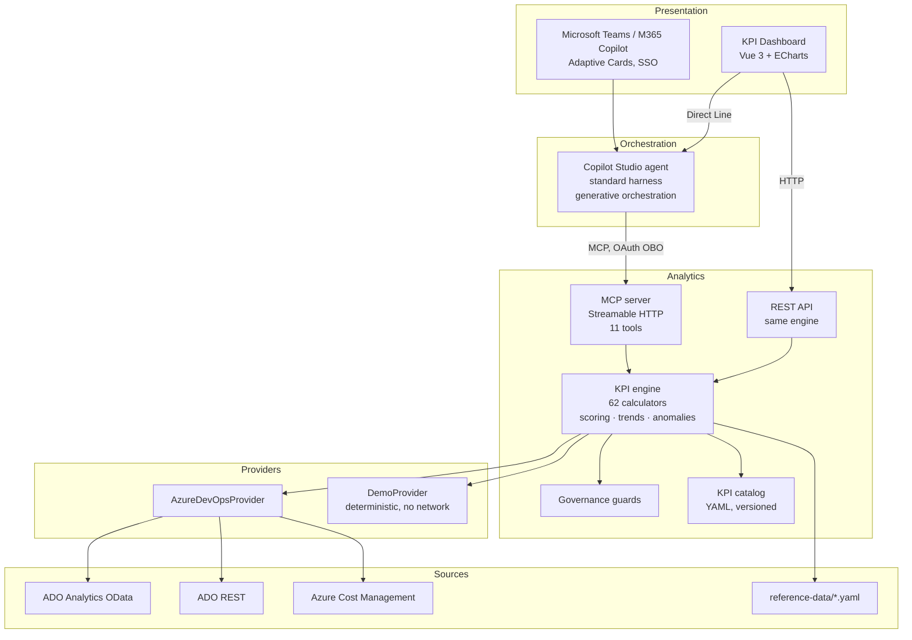

# Architecture

## Layers



## The one design decision that matters

**The KPI engine has no knowledge of where its facts come from.**

A `MetricProvider` supplies raw facts — work items, pipeline runs, pull requests, test results,
capacity, cloud costs. The engine turns those into scored, interpreted KPI values. Nothing in
`calculators.ts` knows whether a work item arrived from OData or from a seeded generator.

That single separation buys three things:

1. **The offline demo is real.** Swapping the provider gives an identical code path against
   seeded data — the demo exercises the actual formulas, not a mock of them.
2. **The formulas are testable.** 33 tests assert on exact values, because the demo provider is
   deterministic for a given seed.
3. **The source can change.** Adding a Fabric or Azure SQL aggregation layer means writing one
   provider, not rewriting 62 calculators.

## Request flow

```
"What is our change failure rate this quarter?"
  │
  ├─ Copilot Studio: generative orchestration selects get_kpis
  ├─ MCP call over Streamable HTTP with the user's bearer token
  │
  ├─ MCP server
  │   ├─ resolvePeriod("last quarter") → explicit ISO window
  │   ├─ buildScope() → aggregation level inferred from what was supplied
  │   ├─ guards: is this KPI permitted at this aggregation?
  │   ├─ provider: load facts once for the window (7 parallel calls)
  │   ├─ calculator: compute, or return the named missing inputs
  │   ├─ scoring: value + thresholds + direction → good / warn / bad
  │   ├─ comparison: recompute over the preceding equal window
  │   └─ render: Markdown table + structured payload
  │
  └─ Copilot Studio composes the answer with scope and period stated
```

## Key components

### KPI catalog — `kpi-engine/catalog/*.yaml`

YAML rather than TypeScript, deliberately: a finance partner or delivery manager should be
able to audit a formula in a pull request without reading code.

Each entry carries id, revision, formula, unit, direction, feasibility, sources, thresholds,
benchmarks, interpretation, caveats, paired KPIs and minimum aggregation.

The catalog is loaded once and validated on load: ids must be domain-prefixed, must be unique,
and every `pairs_with` must resolve. A malformed catalog fails at startup rather than
producing wrong answers at runtime.

### Governance guards — `mcp-server/src/kpi/guards.ts`

Enforced in code, not documented as convention. Blocks person-level computation for every KPI
and cross-team comparison for team-local units. See [RESPONSIBLE-METRICS.md](RESPONSIBLE-METRICS.md).

### Calculators — `mcp-server/src/kpi/calculators.ts`

One function per KPI, each returning either a value or a structured explanation of what was
missing. Every calculator returns `missingInputs` by name — that is what allows the agent and
the dashboard to say "configure `rates.blendedLoadedRate`" instead of showing a zero.

Percentiles use linear interpolation (R-7), matching Excel's `PERCENTILE.INC` and Azure DevOps
widget conventions. Distribution KPIs report P50, P85 and P95 rather than a mean, because
lead-time and duration distributions are heavily right-skewed and a mean is dominated by a
handful of stalled items.

### Engine — `mcp-server/src/kpi/engine.ts`

Loads facts once per scope and period, then computes every requested KPI against that single
context. Handles scoring, period comparison, trend bucketing, scorecard assembly, data-quality
assessment and anomaly detection.

Anomalies use a **modified z-score** based on median absolute deviation rather than a mean and
standard deviation. Cost and duration series are right-skewed; with a conventional z-score, a
single extreme value inflates the standard deviation enough to hide itself.

### Providers — `mcp-server/src/providers/`

**`AzureDevOpsProvider`** pushes aggregation into OData `$apply` wherever OData can express it,
and pages with a hard row cap where it cannot. On hitting the cap it throws `TruncationError`
rather than returning a partial aggregate — a KPI computed on truncated data is worse than no
KPI, because it looks correct.

**`DemoProvider`** generates four projects with distinct archetypes: `healthy`,
`cost-pressure`, `pipeline-waste`, `delivery-risk`. Each archetype biases failure rates, lead
times, flow efficiency, review latency and cloud cost. This is shaped rather than random so a
demonstration has something worth reasoning about. Deterministic via xorshift32 from a seed.

### Tools — `mcp-server/src/tools/`

Eleven tools, kept deliberately few and broad. Copilot Studio's tool-selection accuracy
degrades beyond roughly 30–40 total choices across tools, topics and connected agents, so each
tool is parameterised rather than narrow.

Every tool returns both Markdown text (for the chat channel, which cannot render charts) and a
structured payload (for the dashboard).

### Dashboard — `dashboard/`

Modular Vue 3 single-file components. This is a deliberate reaction to the previous agent's
8,500-line single-file chat view: `KpiTile`, `Sparkline`, `ScoreGauge`, `KpiDrawer` and
`ChatPanel` are each independently comprehensible.

Sparklines are hand-rolled SVG paths rather than chart instances — a scorecard renders 60+
tiles, and 60 ECharts instances costs roughly a second of main-thread time on a demo laptop.
ECharts is used only in the drill-down drawer, where interactivity earns its cost.

## Scope and aggregation

Aggregation level is inferred from what the caller supplies:

| Supplied | Aggregation |
| --- | --- |
| organisation only | `organization` |
| + project | `project` |
| + team | `team` |
| + repository | `repository` |
| a person | **rejected** |

## Period handling

All periods resolve to explicit ISO windows before any query runs. Relative expressions
("last quarter", "ytd") are parsed by an allow-list; an uninterpretable expression is rejected
with guidance rather than silently defaulted.

Period-over-period comparison uses the immediately preceding **equal-length** window, so the
comparison is like-for-like. Trends split the window into equal buckets and compute the KPI
independently in each — which is why a trend costs more than a point value, and why the
dashboard requests it only for headline KPIs.

## Extending it

**Adding a KPI:** add the definition to the domain YAML, add a calculator keyed by the same
id, run the tests. A test asserts that the catalog and the calculator registry cannot drift
apart, so a missing calculator fails CI immediately.

**Adding a data source:** implement `MetricProvider`. No calculator changes.

**Adding a tool:** register it in `tools/index.ts`. Copilot Studio discovers it dynamically —
no change is needed on the Copilot Studio side, which is the main reason MCP was chosen over
eleven individual custom connectors.
