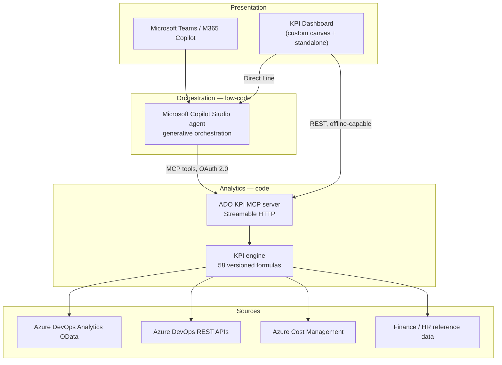

# ADR-0001 — Agent platform: Microsoft Copilot Studio, custom code, or hybrid?

- **Status:** Accepted
- **Date:** 2026-08-14
- **Deciders:** Platform architecture
- **Supersedes:** none
- **Related:** ADR-0002 (compute back end), ADR-0003 (aggregation layer), ADR-0004 (visualisation surface)

## Context

We already operate the **Azure FinOps Agent**, a custom-code agent: a .NET orchestrator, a
TypeScript MCP server for Azure cost intelligence, Bicep infrastructure, GitHub Actions CI/CD
and a self-hosted Vue web UI.

We now need a second agent — the **Azure DevOps FinOps & Delivery Intelligence Agent** — that
surfaces FinOps, engineering-performance and project-profitability KPIs from Azure DevOps.

A proposal was raised that this second agent should be built on **Microsoft Copilot Studio**,
on the assumption that *"Copilot Studio is better and simpler than the Azure + GitHub
architecture used for the first agent."*

This ADR records the evaluation of that assumption and the resulting decision.

## Evaluation of the assumption

The assumption was tested against the current (mid-2026) Copilot Studio platform documentation.
**It is partially correct.** It holds for the conversational layer and is wrong for the
analytical and presentation layers.

### Where the assumption holds

| Claim | Verdict | Evidence |
| --- | --- | --- |
| Faster time-to-value | **True** | Generative orchestration, knowledge sources and tools are configuration, not code. Days rather than weeks to a demonstrable agent. |
| Less infrastructure to own | **True** | No App Service, no container registry, no bot hosting, no token cache to run for the chat surface. |
| Governance is built in | **True** | Power Platform DLP, Purview audit, Agent 365 agent inventory, customer-managed keys, VNet subnet delegation, tenant data residency — all platform features rather than things we build. |
| Enterprise identity is easier | **True** | "Authenticate manually" with Microsoft Entra ID v2 yields `User.AccessToken`, enabling on-behalf-of calls to Azure DevOps with the *user's own* permissions. No service account to share, no secret to rotate in our code. |
| Teams / M365 Copilot distribution is free | **True** | Native channels with SSO and Adaptive Card rendering, no custom client to build or ship. |
| Our existing MCP investment is reusable | **True** | MCP is GA in Copilot Studio over Streamable HTTP, with API-key or OAuth 2.0 auth. An MCP server is registered as a tool and tool changes are picked up dynamically. |

### Where the assumption breaks

| Claim | Verdict | Evidence |
| --- | --- | --- |
| It can be our KPI dashboard | **False** | Native rendering is limited to Adaptive Card primitives — text, images, tables, buttons. There is no native chart rendering. An interactive KPI dashboard requires an external surface (custom canvas over Direct Line, a Power BI report, or a Teams tab). |
| It can crunch the data | **False** | A 5 MB connector payload ceiling and a ~2-minute synchronous action timeout make real-time OData aggregation over large Azure DevOps histories unreliable. Aggregation must happen somewhere else. |
| It is cheaper | **Not proven** | Billing is Copilot Credits at $0.01/credit (PAYG). A multi-tool analytical query plausibly consumes 10–50 credits. At high volume this can exceed the cost of hosting our own orchestration against a model endpoint. Cost is workload-shaped, not platform-shaped. |
| It can be demonstrated offline | **False** | Copilot Studio is pure SaaS. There is no emulator, no container image and no offline mode. The Bot Framework Emulator does not apply to the Copilot Studio runtime. |
| It gives full CI/CD parity | **Partially false** | Agent definitions, topics, tools, agent flows and environment variables are solution-aware and can live in Git. Application Insights settings, manual authentication settings, Direct Line/web channel security and sharing permissions are **not** solution-aware and need post-deployment configuration. |

### Decisive constraints for *this* product

1. The deliverable is explicitly a **KPI dashboard with an improved interface**. Chat alone does not satisfy it.
2. Azure DevOps Analytics history for a real organisation is large; every headline KPI is an aggregate.
3. A **local, offline demo executable** is a hard requirement.
4. The KPI formulas are the intellectual property of this product and must be unit-testable and version-controlled.

Constraints 1 and 3 cannot be met by Copilot Studio alone. Constraints 2 and 4 are met poorly by
low-code and well by code.

## Decision

**We adopt the hybrid architecture (option C).**

- **Microsoft Copilot Studio is the conversational front end and the orchestration brain.**
  Generative orchestration, Entra ID authentication, Teams and M365 Copilot channels, DLP,
  Purview and Agent 365 governance.
- **A TypeScript MCP server is the analytical back end.** It owns every Azure DevOps Analytics
  OData query, every Azure Cost Management call, and every KPI formula. It runs server-side,
  so payload ceilings and action timeouts constrain only the *answer*, never the *computation*.
- **A dedicated web dashboard is the visual surface.** It is the "improved interface" deliverable,
  it doubles as the Copilot Studio custom canvas over Direct Line, and — critically — it runs
  standalone against the MCP server for the offline demo.

This keeps the low-code advantage where low-code is genuinely better (conversation, identity,
governance, distribution) and keeps code where code is genuinely better (aggregation, formulas,
visualisation, offline).

## Consequences

### Positive

- Meets all four decisive constraints.
- KPI formulas are unit-tested code, not clicks in a designer — they can be reviewed, diffed and regression-tested.
- The offline demo path exists because the dashboard and MCP server are ours.
- Copilot Studio governance applies to the conversational surface without us building it.
- The MCP server is portable: it can be re-pointed at another orchestrator with no formula rewrite.

### Negative

- **Two platforms to operate**, with two ALM models: Power Platform solutions promoted through
  environments, and Git-based CI/CD for the code. Accepted; mitigated by ADR-0005.
- **Split source of truth for the agent definition.** Non-solution-aware settings are captured as
  scripted post-deployment steps in `copilot-studio/scripts/` so they are still reviewable.
- **Two identity paths.** User-delegated for interactive queries, workload identity for scheduled
  aggregation. Documented in `docs/SECURITY.md`.
- **Copilot Credit consumption must be monitored** from day one; a credit budget alert is part of
  the deployment checklist.

### Rejected options

**(A) Pure Copilot Studio.** Rejected: cannot render the required dashboard, cannot aggregate at
volume, cannot be demonstrated offline, and would move the KPI formulas out of source control.

**(B) Pure custom code** — repeating the first agent's architecture. Rejected: it would rebuild
identity, governance, Teams distribution and admin tooling that Copilot Studio already provides,
for no functional gain. This is the part of the original assumption that is correct.

## Conditions that would reverse this decision

- If Copilot Studio gains native, interactive chart rendering **and** server-side aggregation
  without payload/timeout limits, option (A) becomes viable and the dashboard becomes optional.
- If the offline demo requirement is dropped **and** Teams becomes the only surface, option (A)
  becomes viable.
- If measured Copilot Credit consumption exceeds the cost of self-hosted orchestration by more
  than 3× at steady-state volume, the orchestration layer should be re-evaluated.

## References

- Copilot Studio harnesses, generative orchestration, tools and MCP support — Microsoft Learn
- Copilot Studio quotas and limits (payload, topics, knowledge sources, request rates) — Microsoft Learn
- Copilot Studio billing and licensing (Copilot Credits) — Microsoft Learn
- Power Platform ALM: pipelines, Build Tools, Dataverse Git integration — Microsoft Learn
- Azure DevOps Analytics OData entity references — Microsoft Learn
- Full evidence base: [`docs/PLATFORM-EVALUATION.md`](../PLATFORM-EVALUATION.md)
